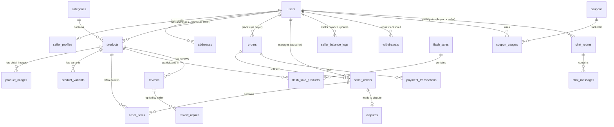

# Thiết Kế Database Schema - Sàn Thương Mại Điện Tử Multi-vendor

Bản thiết kế này được tối ưu hóa cho dự án làm trong **1-2 tháng** bởi nhóm **3 người**. Để hoàn thành kịp tiến độ mà vẫn đảm bảo tính mở rộng và khả năng chịu tải tốt, hệ thống sẽ **không dùng EAV phức tạp** giống Bagisto mà sử dụng **Flat-table kết hợp JSON columns** để lưu trữ thuộc tính sản phẩm linh hoạt. Đồng thời tích hợp cơ chế tách đơn hàng (Order Splitting) phục vụ mô hình Multi-vendor.

---

## 1. Phân Nhóm 1: Users, Roles & Permissions (Auth & RBAC)

Hệ thống sử dụng bảng `users` chung cho tất cả các đối tượng đăng nhập để dễ dàng liên kết dữ liệu (Tin nhắn, Đơn hàng, Đánh giá), phân biệt vai trò qua trường `role` và lưu thông tin chi tiết của người bán qua bảng riêng `seller_profiles`.

### Bảng `users` (Tất cả người dùng hệ thống)
| Tên cột | Kiểu dữ liệu | Thuộc tính | Mô tả |
| :--- | :--- | :--- | :--- |
| `id` | bigint | **Primary Key** | ID người dùng |
| `name` | varchar(255) | Not Null | Tên hiển thị |
| `email` | varchar(255) | **Unique Index**, Not Null | Email đăng nhập |
| `password` | varchar(255) | Not Null | Mật khẩu mã hóa |
| `phone` | varchar(20) | Nullable | Số điện thoại |
| `role` | enum | **Index**, Not Null | 'admin', 'seller', 'customer' |
| `status` | enum | **Index**, Default: 'active' | Trạng thái tài khoản ('active', 'blocked') |
| `email_verified_at` | timestamp | Nullable | Thời gian xác thực email |
| `created_at` / `updated_at`| timestamp | Nullable | Thời gian tạo/cập nhật |

### Bảng `seller_profiles` (Thông tin riêng của Shop)
| Tên cột | Kiểu dữ liệu | Thuộc tính | Mô tả |
| :--- | :--- | :--- | :--- |
| `id` | bigint | **Primary Key** | ID profile |
| `user_id` | bigint | **Foreign Key & Unique Index** -> `users.id` | Mỗi user chỉ có duy nhất 1 shop |
| `shop_name` | varchar(255) | Not Null | Tên gian hàng |
| `slug` | varchar(255) | **Unique Index**, Not Null | Đường dẫn đẹp của shop |
| `logo` | varchar(255) | Nullable | Link ảnh logo shop |
| `banner` | varchar(255) | Nullable | Ảnh bìa shop |
| `description` | text | Nullable | Mô tả shop |
| `address` | varchar(255) | Not Null | Địa chỉ lấy hàng |
| `commission_rate` | decimal(5,2) | Default: 5.00 | % hoa hồng sàn thu riêng của shop này (ví dụ: 5.00%) |
| `balance` | decimal(15,2) | Default: 0.00 | Số dư khả dụng hiện tại (tiền ví bán hàng) |
| `bank_name` | varchar(100) | Nullable | Tên ngân hàng rút tiền |
| `bank_account` | varchar(50) | Nullable | Số tài khoản ngân hàng |
| `bank_owner` | varchar(100) | Nullable | Tên chủ tài khoản |
| `status` | enum | **Index**, Default: 'pending' | Trạng thái duyệt shop ('pending', 'approved', 'rejected', 'blocked') |
| `created_at` / `updated_at`| timestamp | Nullable | |

### Bảng `addresses` (Sổ địa chỉ của Khách hàng)
| Tên cột | Kiểu dữ liệu | Thuộc tính | Mô tả |
| :--- | :--- | :--- | :--- |
| `id` | bigint | **Primary Key** | |
| `user_id` | bigint | **Foreign Key & Index** -> `users.id` | Khách hàng sở hữu địa chỉ |
| `recipient_name` | varchar(255) | Not Null | Tên người nhận |
| `recipient_phone`| varchar(20) | Not Null | SĐT người nhận |
| `address_detail` | varchar(255) | Not Null | Số nhà, tên đường |
| `ward` / `district` / `province`| varchar(100) | Not Null | Phường/Xã, Quận/Huyện, Tỉnh/Thành phố |
| `is_default` | boolean | Default: false | Địa chỉ mặc định giao hàng |
| `created_at` / `updated_at`| timestamp | Nullable | |

### Phân quyền Admin (Spatie Laravel-Permission Style)
Để phân quyền nhân viên nội bộ (ví dụ: Admin chính, Kế toán, Chăm sóc khách hàng duyệt sản phẩm), khuyến khích dùng thư viện `spatie/laravel-permission` để tự động sinh cấu trúc:
*   `roles` (`id`, `name`, `guard_name`)
*   `permissions` (`id`, `name`, `guard_name`)
*   `model_has_roles` (`role_id`, `model_type`, `model_id` - trỏ tới bảng `users`)
*   `role_has_permissions` (`role_id`, `permission_id`)

---

## 2. Phân Nhóm 2: Categories & Products (Danh Mục & Sản Phẩm)

Để tăng tốc phát triển, tránh sử dụng EAV. Các thông số động của sản phẩm (như cấu hình RAM, màu sắc phụ...) lưu vào một cột dạng `json` trong bảng sản phẩm.

### Bảng `categories` (Danh mục - Chỉ Admin quản lý)
| Tên cột | Kiểu dữ liệu | Thuộc tính | Mô tả |
| :--- | :--- | :--- | :--- |
| `id` | bigint | **Primary Key** | |
| `parent_id` | bigint | **Foreign Key & Index**, Nullable -> `categories.id` | Cho phép làm danh mục đa cấp (Cha - Con) |
| `name` | varchar(255) | Not Null | Tên danh mục |
| `slug` | varchar(255) | **Unique Index**, Not Null | Đường dẫn thân thiện |
| `image` | varchar(255) | Nullable | Ảnh đại diện danh mục |
| `status` | boolean | **Index**, Default: true | Trạng thái hiển thị |
| `created_at` / `updated_at`| timestamp | Nullable | |

### Bảng `products` (Bảng sản phẩm chính - Seller đăng, Admin duyệt)
| Tên cột | Kiểu dữ liệu | Thuộc tính | Mô tả |
| :--- | :--- | :--- | :--- |
| `id` | bigint | **Primary Key** | |
| `seller_id` | bigint | **Foreign Key & Index** -> `users.id` | Shop sở hữu sản phẩm này |
| `category_id` | bigint | **Foreign Key & Index** -> `categories.id` | Danh mục sản phẩm |
| `name` | varchar(255) | Not Null | Tên sản phẩm |
| `slug` | varchar(255) | **Unique Index**, Not Null | Đường dẫn tĩnh sản phẩm |
| `sku` | varchar(100) | **Unique Index**, Not Null | Mã quản lý kho hàng |
| `price` | decimal(15,2) | Not Null | Giá gốc bán ra |
| `stock` | int | Default: 0 | Số lượng tồn kho gốc |
| `thumbnail` | varchar(255) | Not Null | Ảnh đại diện sản phẩm |
| `description` | text | Not Null | Mô tả chi tiết (HTML) |
| `short_description`| text | Nullable | Mô tả ngắn |
| `attributes` | json | Nullable | Thuộc tính linh hoạt dạng JSON (Ví dụ: `{ "color": "red", "brand": "Samsung" }`) |
| `status` | enum | **Index**, Default: 'draft' | Trạng thái duyệt ('draft', 'pending', 'approved', 'rejected', 'blocked') |
| `admin_note` | text | Nullable | Lý do Admin từ chối duyệt hoặc khóa sản phẩm |
| `views_count` | int | Default: 0 | Số lượt xem sản phẩm (để làm Recommendation/Trending) |
| `created_at` / `updated_at`| timestamp | Nullable | |

### Bảng `product_images` (Ảnh chi tiết sản phẩm)
| Tên cột | Kiểu dữ liệu | Thuộc tính | Mô tả |
| :--- | :--- | :--- | :--- |
| `id` | bigint | **Primary Key** | |
| `product_id` | bigint | **Foreign Key & Index** -> `products.id` | |
| `image_path` | varchar(255) | Not Null | |
| `sort_order` | int | Default: 0 | Thứ tự sắp xếp hiển thị |

### Bảng `product_variants` (Nếu muốn làm phân loại Size/Màu sắc - Tùy chọn)
| Tên cột | Kiểu dữ liệu | Thuộc tính | Mô tả |
| :--- | :--- | :--- | :--- |
| `id` | bigint | **Primary Key** | |
| `product_id` | bigint | **Foreign Key & Index** -> `products.id` | |
| `name` | varchar(100) | Not Null | Tên biến thể (Ví dụ: "Màu Đen, Size XL") |
| `sku` | varchar(100) | **Unique Index**, Not Null | SKU riêng của biến thể |
| `price` | decimal(15,2) | Nullable | Nếu null thì lấy giá của `products.price` |
| `stock` | int | Default: 0 | Tồn kho riêng của biến thể này |
| `image_path` | varchar(255) | Nullable | Ảnh riêng của biến thể |

---

## 3. Phân Nhóm 3: Cart & Orders (Giỏ Hàng & Tách Đơn Hàng Multi-Vendor)

Khi người mua bỏ sản phẩm của **Seller A** và **Seller B** vào cùng 1 giỏ hàng và ấn thanh toán:
1.  Hệ thống tạo ra **1 Đơn hàng Cha (`orders`)** để thanh toán tổng tiền qua cổng VNPay/MoMo hoặc COD.
2.  Đồng thời tự động tách thành **2 Đơn hàng Con (`seller_orders`)** tương ứng cho Seller A và Seller B để họ tự chuẩn bị hàng, gọi vận chuyển và cập nhật trạng thái đơn của mình.

### Bảng `carts` & `cart_items` (Giỏ hàng lưu trữ tạm)
*   `carts` (`id`, `user_id` [**Foreign Key & Index**, Nullable], `session_id` [**Index**], `created_at`, `updated_at`)
*   `cart_items` (`id`, `cart_id` [**Foreign Key & Index**], `product_id` [**Foreign Key & Index**], `product_variant_id` [**Foreign Key & Index**, Nullable], `quantity`, `created_at`, `updated_at`)

### Bảng `orders` (Đơn hàng Tổng / Hóa đơn thanh toán)
| Tên cột | Kiểu dữ liệu | Thuộc tính | Mô tả |
| :--- | :--- | :--- | :--- |
| `id` | bigint | **Primary Key** | |
| `order_number` | varchar(50) | **Unique Index**, Not Null | Mã đơn hàng (Ví dụ: ORDER-20260727-XXXX) |
| `user_id` | bigint | **Foreign Key & Index** -> `users.id` | Người mua hàng |
| `total_item_amount`| decimal(15,2) | Not Null | Tổng tiền hàng gốc trước ship/giảm giá |
| `total_shipping_fee`| decimal(15,2)| Default: 0.00 | Tổng phí ship của tất cả các shop cộng lại |
| `total_discount` | decimal(15,2) | Default: 0.00 | Tổng số tiền được giảm |
| `grand_total` | decimal(15,2) | Not Null | Số tiền khách phải trả thực tế |
| `payment_method` | enum | **Index**, Not Null | 'cod', 'vnpay', 'momo' |
| `payment_status` | enum | **Index**, Default: 'pending' | Trạng thái thanh toán ('pending', 'paid', 'failed', 'refunded') |
| `shipping_name` | varchar(255) | Not Null | Tên người nhận hàng |
| `shipping_phone` | varchar(20) | Not Null | SĐT nhận hàng |
| `shipping_address` | varchar(500) | Not Null | Địa chỉ nhận hàng đầy đủ |
| `notes` | text | Nullable | Ghi chú của khách hàng |
| `created_at` / `updated_at`| timestamp | Nullable | |

### Bảng `seller_orders` (Đơn hàng con tách theo từng Seller)
| Tên cột | Kiểu dữ liệu | Thuộc tính | Mô tả |
| :--- | :--- | :--- | :--- |
| `id` | bigint | **Primary Key** | |
| `order_id` | bigint | **Foreign Key & Index** -> `orders.id` | Thuộc đơn hàng cha nào |
| `seller_id` | bigint | **Foreign Key & Index** -> `users.id` | Shop xử lý đơn này |
| `sub_total` | decimal(15,2) | Not Null | Tổng tiền hàng của riêng shop này |
| `shipping_fee` | decimal(15,2) | Default: 0.00 | Phí ship riêng của gói hàng này |
| `discount_amount`| decimal(15,2) | Default: 0.00 | Số tiền giảm từ voucher áp riêng cho shop này |
| `grand_total` | decimal(15,2) | Not Null | `sub_total` + `shipping_fee` - `discount_amount` |
| `commission_amount`| decimal(15,2)| Not Null | Phí hoa hồng sàn thu từ đơn này |
| `status` | enum | **Index**, Default: 'pending' | **Trạng thái giao hàng do Seller cập nhật** ('pending', 'confirmed', 'shipping', 'completed', 'cancelled') |
| `tracking_number`| varchar(100) | **Index**, Nullable | Mã vận đơn của bên vận chuyển |
| `created_at` / `updated_at`| timestamp | Nullable | |

### Bảng `order_items` (Chi tiết sản phẩm trong đơn hàng con)
| Tên cột | Kiểu dữ liệu | Thuộc tính | Mô tả |
| :--- | :--- | :--- | :--- |
| `id` | bigint | **Primary Key** | |
| `seller_order_id`| bigint | **Foreign Key & Index** -> `seller_orders.id` | Thuộc đơn hàng con nào |
| `product_id` | bigint | **Foreign Key & Index**, Nullable -> `products.id` | Link sản phẩm gốc |
| `product_variant_id`| bigint | **Foreign Key & Index**, Nullable | Link biến thể gốc |
| `product_name` | varchar(255) | Not Null | Lưu snapshot tên sản phẩm đề phòng đổi tên |
| `product_image` | varchar(255) | Nullable | Lưu snapshot ảnh |
| `price` | decimal(15,2) | Not Null | Giá tại thời điểm mua |
| `quantity` | int | Not Null | Số lượng mua |
| `total` | decimal(15,2) | Not Null | `price` * `quantity` |

---

## 4. Phân Nhóm 4: Payments, Balances & Withdrawals (Thanh Toán & Ví Tiền)

Nhóm này xử lý dòng tiền của Sàn. Khách thanh toán qua ví/cổng. Khi đơn hàng hoàn thành (`completed`), tiền đơn hàng sau khi trừ đi phí hoa hồng sàn (`commission_amount`) sẽ được cộng vào Ví (`balance`) của Seller. Seller có thể tạo yêu cầu rút tiền về ngân hàng của mình.

### Bảng `payment_transactions` (Nhật ký giao dịch cổng thanh toán VNPay/Momo)
| Tên cột | Kiểu dữ liệu | Thuộc tính | Mô tả |
| :--- | :--- | :--- | :--- |
| `id` | bigint | **Primary Key** | |
| `order_id` | bigint | **Foreign Key & Index** -> `orders.id` | |
| `transaction_no` | varchar(100) | **Unique Index**, Nullable | Mã giao dịch trả về từ VNPay/Momo |
| `payment_gateway`| enum | **Index**, Not Null | 'vnpay', 'momo' |
| `amount` | decimal(15,2) | Not Null | Số tiền giao dịch |
| `status` | enum | **Index**, Default: 'pending' | 'pending', 'success', 'failed' |
| `raw_response` | json | Nullable | Lưu toàn bộ payload callback trả về để đối soát lỗi |
| `created_at` | timestamp | Nullable | |

### Bảng `seller_balance_logs` (Nhật ký biến động số dư Ví Seller)
| Tên cột | Kiểu dữ liệu | Thuộc tính | Mô tả |
| :--- | :--- | :--- | :--- |
| `id` | bigint | **Primary Key** | |
| `seller_id` | bigint | **Foreign Key & Index** -> `users.id` | Shop sở hữu số tiền |
| `amount` | decimal(15,2) | Not Null | Số tiền biến động |
| `type` | enum | **Index**, Not Null | 'order_earning', 'withdrawal', 'refund' |
| `reference_id` | bigint | **Index**, Nullable | Trỏ tới `seller_orders.id` hoặc `withdrawals.id` |
| `description` | varchar(255) | Nullable | Ghi chú biến động |
| `created_at` | timestamp | Nullable | |

### Bảng `withdrawals` (Yêu cầu rút tiền của Seller)
| Tên cột | Kiểu dữ liệu | Thuộc tính | Mô tả |
| :--- | :--- | :--- | :--- |
| `id` | bigint | **Primary Key** | |
| `seller_id` | bigint | **Foreign Key & Index** -> `users.id` | Seller yêu cầu |
| `amount` | decimal(15,2) | Not Null | Số tiền muốn rút |
| `bank_name` | varchar(100) | Not Null | Ngân hàng |
| `bank_account` | varchar(50) | Not Null | Số tài khoản |
| `bank_owner` | varchar(100) | Not Null | Tên chủ tài khoản ngân hàng |
| `status` | enum | **Index**, Default: 'pending' | Trạng thái duyệt ('pending', 'approved', 'rejected') |
| `admin_note` | text | Nullable | Ghi chú của admin khi từ chối |
| `created_at` / `updated_at`| timestamp | Nullable | |

---

## 5. Phân Nhóm 5: Vouchers & Flash Sales

### Bảng `coupons` (Mã giảm giá - Hỗ trợ cả Admin & Seller)
| Tên cột | Kiểu dữ liệu | Thuộc tính | Mô tả |
| :--- | :--- | :--- | :--- |
| `id` | bigint | **Primary Key** | |
| `seller_id` | bigint | **Foreign Key & Index**, Nullable -> `users.id` | Null: Voucher toàn sàn, có ID: Voucher của Shop |
| `code` | varchar(50) | **Unique Index**, Not Null | Mã giảm giá (Ví dụ: `ADMINVOUCHER10`) |
| `type` | enum | Not Null | 'fixed_amount', 'percentage' |
| `value` | decimal(15,2) | Not Null | Giá trị giảm |
| `min_order_amount`| decimal(15,2) | Default: 0.00 | Đơn hàng tối thiểu để áp dụng |
| `max_discount` | decimal(15,2) | Nullable | Giới hạn giảm tối đa |
| `usage_limit` | int | Default: 1 | Tổng lượt sử dụng tối đa của voucher |
| `used_count` | int | Default: 0 | Số lượt đã sử dụng |
| `starts_at` | timestamp | **Index**, Nullable | Ngày bắt đầu |
| `expires_at` | timestamp | **Index**, Nullable | Ngày hết hạn |
| `status` | boolean | **Index**, Default: true | Kích hoạt hoặc Vô hiệu hóa |
| `created_at` / `updated_at`| timestamp | Nullable | |

### Bảng `coupon_usages` (Tránh một người dùng một coupon nhiều lần)
*   `coupon_usages` (`id`, `coupon_id` [**Foreign Key & Index**], `user_id` [**Foreign Key & Index**], `order_id` [**Foreign Key & Index**], `created_at`)

### Bảng `flash_sales` (Chương trình Flash Sale - Admin cấu hình)
| Tên cột | Kiểu dữ liệu | Thuộc tính | Mô tả |
| :--- | :--- | :--- | :--- |
| `id` | bigint | **Primary Key** | |
| `name` | varchar(255) | Not Null | Tên đợt sale (Ví dụ: "Khung giờ vàng 12h-13h") |
| `starts_at` | timestamp | **Index**, Not Null | Thời gian bắt đầu |
| `ends_at` | timestamp | **Index**, Not Null | Thời gian kết thúc |
| `status` | boolean | **Index**, Default: true | Trạng thái kích hoạt |
| `created_at` / `updated_at`| timestamp | Nullable | |

### Bảng `flash_sale_products` (Chi tiết sản phẩm tham gia Flash Sale)
| Tên cột | Kiểu dữ liệu | Thuộc tính | Mô tả |
| :--- | :--- | :--- | :--- |
| `id` | bigint | **Primary Key** | |
| `flash_sale_id` | bigint | **Foreign Key & Index** -> `flash_sales.id` | |
| `product_id` | bigint | **Foreign Key & Index** -> `products.id` | |
| `flash_sale_price`| decimal(15,2) | Not Null | Giá đặc biệt khi flash sale |
| `quantity_limit` | int | Not Null | Số lượng sản phẩm đăng ký tham gia |
| `quantity_sold` | int | Default: 0 | Số lượng sản phẩm đã bán ra |

> [!TIP]
> **Giải pháp chống Race Condition (Tranh chấp kho hàng) khi Flash Sale nhiều người mua cùng lúc:**
> 1. Khi kích hoạt Flash Sale, đồng bộ số lượng `quantity_limit` của từng `product_id` lên **Redis** dưới dạng một Key (Ví dụ: `flash_sale_stock:product_123` = 10).
> 2. Khi User bấm mua, sử dụng lệnh `DECR` của Redis (Atomic Operation) để trừ kho hàng ngay lập tức trên RAM của Redis trước khi chọc vào Database.
> 3. Nếu Redis trả về giá trị `>= 0` (Thành công): Cho phép tiếp tục đặt hàng, đẩy đơn vào **Queue** của Laravel để ghi dữ liệu xuống DB không đồng bộ.
> 4. Nếu Redis trả về `< 0` (Hết hàng): Trả về lỗi hết hàng ngay lập tức (Thời gian phản hồi chỉ mất vài mili-giây, bảo vệ hệ thống không bị sập DB).

---

## 6. Phân Nhóm 6: Chat & Reviews (Tương Tác Real-time & Đánh Giá)

### Bảng `chat_rooms` (Phòng chat giữa Buyer và Seller)
| Tên cột | Kiểu dữ liệu | Thuộc tính | Mô tả |
| :--- | :--- | :--- | :--- |
| `id` | bigint | **Primary Key** | |
| `buyer_id` | bigint | **Foreign Key** -> `users.id` | User mua hàng |
| `seller_id` | bigint | **Foreign Key** -> `users.id` | User bán hàng |
| `created_at` / `updated_at`| timestamp | Nullable | |
*   **Unique Index:** Tạo index tổ hợp `(buyer_id, seller_id)` dạng Unique để đảm bảo 1 cặp Buyer-Seller chỉ có duy nhất 1 phòng chat.

### Bảng `chat_messages` (Tin nhắn trong phòng chat)
| Tên cột | Kiểu dữ liệu | Thuộc tính | Mô tả |
| :--- | :--- | :--- | :--- |
| `id` | bigint | **Primary Key** | |
| `chat_room_id` | bigint | **Foreign Key & Index** -> `chat_rooms.id` | |
| `sender_id` | bigint | **Foreign Key & Index** -> `users.id` | Người gửi |
| `message` | text | Not Null | Nội dung tin nhắn chữ |
| `image_path` | varchar(255) | Nullable | Ảnh đính kèm (nếu có) |
| `is_read` | boolean | Default: false | Đã đọc hay chưa |
| `created_at` | timestamp | **Index** | Thời gian gửi tin nhắn (phục vụ ORDER BY) |

### Bảng `reviews` (Đánh giá sản phẩm - Khách hàng)
| Tên cột | Kiểu dữ liệu | Thuộc tính | Mô tả |
| :--- | :--- | :--- | :--- |
| `id` | bigint | **Primary Key** | |
| `product_id` | bigint | **Foreign Key & Index** -> `products.id` | |
| `user_id` | bigint | **Foreign Key & Index** -> `users.id` | Khách mua hàng đánh giá |
| `order_id` | bigint | **Foreign Key & Index** -> `orders.id` | Đảm bảo chỉ ai mua rồi mới được đánh giá |
| `rating` | tinyint | **Index**, Check (1-5) | Điểm số (1-5 sao) |
| `comment` | text | Nullable | Nhận xét chi tiết |
| `status` | enum | **Index**, Default: 'approved' | Trạng thái hiển thị ('approved', 'hidden') |
| `created_at` / `updated_at`| timestamp | Nullable | |

### Bảng `review_replies` (Phản hồi đánh giá - Seller)
| Tên cột | Kiểu dữ liệu | Thuộc tính | Mô tả |
| :--- | :--- | :--- | :--- |
| `id` | bigint | **Primary Key** | |
| `review_id` | bigint | **Foreign Key & Unique Index** -> `reviews.id` | Mỗi review chỉ có tối đa 1 phản hồi |
| `seller_id` | bigint | **Foreign Key & Index** -> `users.id` | Seller trả lời |
| `reply` | text | Not Null | Nội dung phản hồi |
| `created_at` / `updated_at`| timestamp | Nullable | |

---

## 7. Phân Nhóm 7: Disputes & Refunds (Tranh Chấp & Hoàn Tiền)

Xử lý khiếu nại của khách hàng. Khách gửi yêu cầu khiếu nại -> Admin đứng ra làm trung gian phân xử -> Trả lại tiền cho khách hoặc chuyển tiền cho Seller.

### Bảng `disputes` (Khiếu nại đơn hàng)
| Tên cột | Kiểu dữ liệu | Thuộc tính | Mô tả |
| :--- | :--- | :--- | :--- |
| `id` | bigint | **Primary Key** | |
| `seller_order_id`| bigint | **Foreign Key & Index** -> `seller_orders.id` | Đơn hàng con bị khiếu nại |
| `buyer_id` | bigint | **Foreign Key & Index** -> `users.id` | Người mua khiếu nại |
| `reason` | text | Not Null | Lý do khiếu nại |
| `evidence_images` | json | Nullable | Danh sách ảnh bằng chứng của khách |
| `status` | enum | **Index**, Default: 'pending' | Trạng thái ('pending', 'in_progress', 'refunded', 'rejected') |
| `admin_decision` | text | Nullable | Quyết định và giải thích của Admin |
| `created_at` / `updated_at`| timestamp | Nullable | |

---

## 8. Sơ Đồ Mối Quan Hệ (Mermaid ERD Diagram)

---

## 9. Ý Tưởng Triển Khai Cho Các Tính Năng Điểm Nhấn

1.  **Search & Filter nâng cao (Laravel Scout + Meilisearch)**:
    *   Không cần tạo bảng tìm kiếm. Sử dụng **Laravel Scout** để tự động đồng bộ hóa bảng `products` lên **Meilisearch** khi có sự kiện create/update/delete.
    *   Bộ lọc thuộc tính (Attribute filter) sẽ truy xuất trực tiếp từ trường `attributes` (JSON) đã được Meilisearch index giúp tốc độ tìm kiếm < 50ms.
2.  **Real-time Chat Buyer-Seller (Laravel Echo + Soketi)**:
    *   Khi gửi tin nhắn lưu vào `chat_messages`, trigger một Laravel Event broadcast lên Channel `chat-room.{room_id}`.
    *   Dùng **Soketi** (thay thế cho Pusher mất phí) cài đặt trực tiếp trên Laragon/VPS để xử lý socket real-time.
3.  **Simple Recommendation dựa trên Category & Redis**:
    *   Khi user xem một sản phẩm, ghi lại ID sản phẩm vào Redis (Mỗi user lưu 10 sản phẩm xem gần nhất dạng List Redis: `user_history:{user_id}`).
    *   Trang chủ sẽ lấy lịch sử xem này, query các sản phẩm có cùng `category_id` và loại trừ đi các sản phẩm đã mua để hiển thị phần "Có thể bạn cũng thích".
    *   **Dashboard Caching**: Admin Dashboard query rất nặng do phải sum tiền và đếm số lượng bản ghi. Dùng Redis để Cache kết quả thống kê doanh thu theo ngày/tuần/tháng với thời gian sống (TTL) là 1 giờ. Khi có đơn hàng mới hoàn thành, xóa cache để cập nhật số mới.
